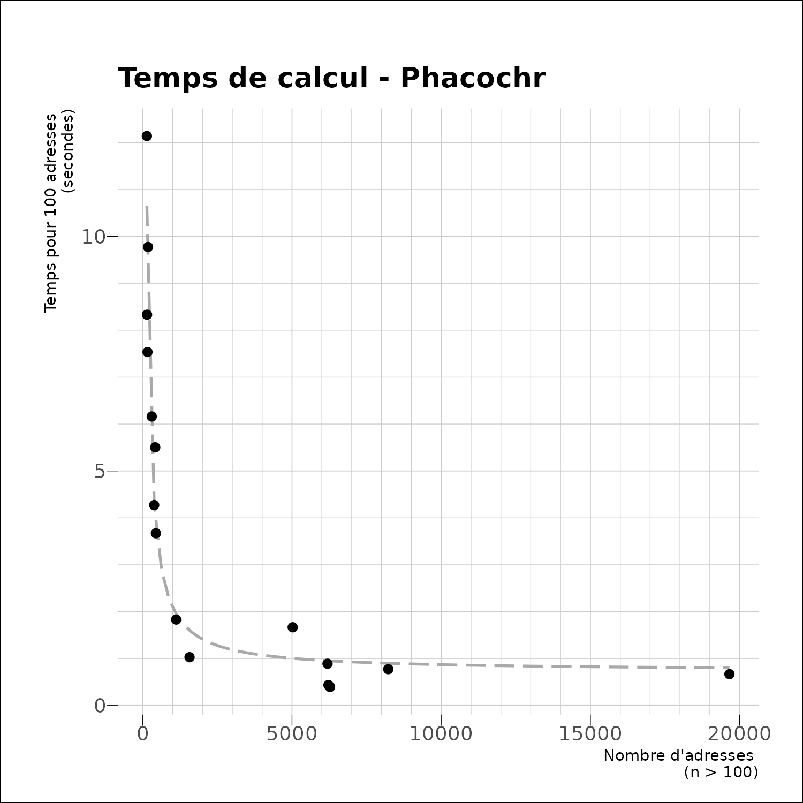
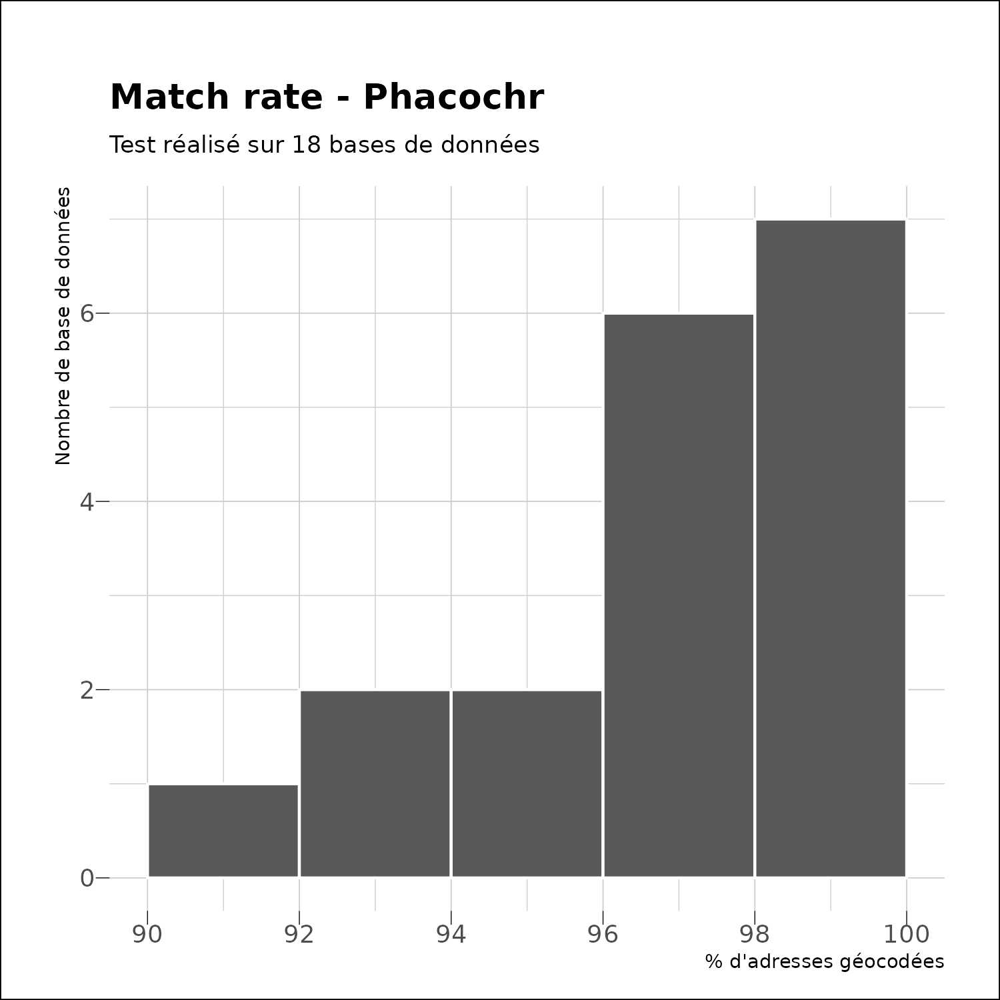
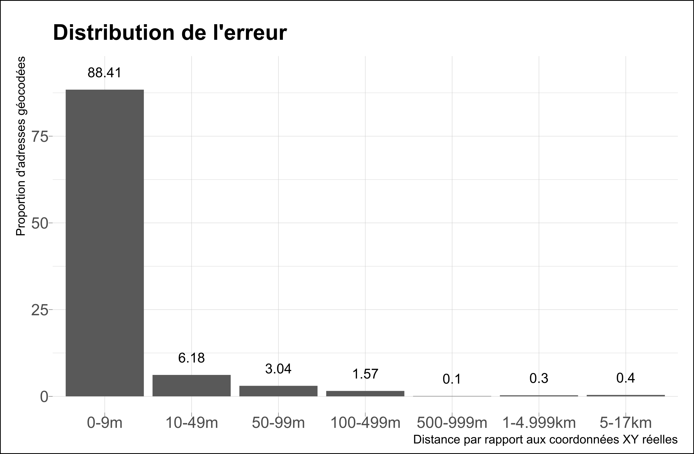

```{r, include = FALSE}
knitr::opts_chunk$set(
  collapse = TRUE,
  comment = "#>",
  fig.path = "man/figures/README-",
  out.width = "100%"
)
```

# phacochr 

<!-- badges: start -->
[](https://github.com/phacochr/phacochr/actions/workflows/R-CMD-check.yaml)
[](https://github.com/phacochr/phacochr/blob/main/LICENSE)
[](https://svgshare.com/i/Zhy.svg)
[](https://svgshare.com/i/ZhY.svg)
[](https://svgshare.com/i/ZjP.svg)

<!-- badges: end -->

`phacochr` est un géocodeur pour la Belgique sous forme de package R. A partir d'une liste d'adresses, il permet de retrouver les coordonnées X-Y nécessaires à toute analyse spatiale, à un niveau de précision du bâtiment.

Le programme fonctionne avec les données publiques [BeST Address](https://opendata.bosa.be/) compilées par BOSA à partir des données régionales Urbis (Région de Bruxelles-Capitale), CRAB (Région flamande) et ICAR (Région wallonne). La logique de `phacochr` est de réaliser une jointure inexacte entre la liste à géocoder et les données BeST Address grâce aux fonctions des packages R [fuzzyjoin](https://cran.r-project.org/web/packages/fuzzyjoin/index.html) et [stringdist](https://cran.r-project.org/web/packages/stringdist/index.html).
`phacochr` dispose de plusieurs options : il peut notamment réaliser des corrections orthographiques (en français et néérlandais) préalables à la détection des rues ou procéder au géocodage au numéro le plus proche - de préférence du même côté de la rue - si les coordonnées du numéro indiqué sont inconnues (par exemple si l'adresse n'existe plus). En cas de non disponibilité du numéro de la rue, le programme indique les coordonnées du numéro médian de la rue. `phacochr` est compatible avec les 3 langues nationales : il géocode des adresses écrites en français, néérlandais ou allemand.

Le package est très rapide pour géocoder de longues listes (la vitesse d’exécution se situe entre 0,4 et 0,8 secondes pour 100 adresses) et le taux de succès pour le géocodage est élevé (médiane de 97%). Voir plus bas le point **Performances de phacochr** pour le détail des performances. `phacochr` constitue donc une alternative très performante face aux solutions existantes tout en reposant entièrement sur des données publiques et des procédures libres.


## Installation

Vous pouvez installer le package `phacochr` depuis [GitHub](https://github.com/). Il est indispensable lors de la première utilisation d'installer les données nécessaires à son utilisation via la fonction `phaco_setup_data()`. Ces fichiers (+/- 265Mo) sont téléchargés et stockés de manière permanente dans un répertoire de travail sur l'ordinateur (dépendant du système d'exploitation et renseigné par la fonction lors de l'installation).

``` r
# Installer devtools si celui-ci n'est pas installé
install.packages("devtools")
library(devtools)

# Installer et charger phacochr
devtools::install_github("phacochr/phacochr")
library(phacochr)

# Installer les données nécessaires à phacochr
phaco_setup_data()
```

Il est également possible pour l'utilisateur de mettre à jour lui-même les données [BeST Address](https://opendata.bosa.be/) (actualisées de manière hebdomadaire par BOSA) vers les dernières données disponibles en ligne avec la fonction `phaco_best_data_update()` :

``` r
phaco_best_data_update()
```

## Exemple de géocodage

Voici un exemple de géocodage d'un data.frame contenant deux adresses :

```{r, include=FALSE}
library(phacochr)
```

```{r , warning = FALSE, message = FALSE}
x <- data.frame(nom = c("Observatoire de la Santé et du Social", "ULB"),
                rue = c("rue Belliard", "avenue Antoine Depage"),
                num = c("71", "30"),
                code_postal = c("1040", "1000"))
x
```

Le géocodage se lance simplement avec la fonction `phaco_geocode()` appliquée à ce data.frame. Nous indiquons dans cet exemple 3 paramètres : les colonnes contenant la rue, le numéro de rue et le code postal, disponibles séparément dans la base de données. Il s'agit de la situation idéale, mais le programme est compatible avec d'autres configurations : celles-ci sont renseignée plus bas au point **Format des données à géocoder**. Mentionnons déjà que le numéro peut ne pas être renseigné ; `phacochr` trouve alors les coordonnées du numéro médian de la rue au code postal indiqué. La fonction dispose de plusieurs options, voir le manuel : https://phacochr.github.io/phacochr/.

```{r , warning = FALSE, message = FALSE,  results='hide'}
result <- phaco_geocode(data_to_geocode = x,
                        colonne_rue= "rue",
                        colonne_num= "num",
                        colonne_code_postal="code_postal")
```

```{r , warning = FALSE, message = FALSE}
result$data_geocoded [,c("ID_address", "x_31370", "y_31370", "cd_sector")]
```

Le package dispose également d'une fonction de cartographie des adresses géocodées. `phaco_map_s()` produit des cartes statiques à partir des données géocodées : il suffit de passer à la fonction l'objet `data_geocoded_sf` créé précédemment par `phaco_geocode()`. La fonction dessine alors les coordonnées des adresses sur une carte dont les frontières administratives sont également affichées. Si les adresses se restreignent à Bruxelles, la carte se limite automatiquement à la Région bruxelloise. Les options de la fonction [sont également renseignées dans le manuel](https://phacochr.github.io/phacochr/).

```{r dpi = 300, warning = FALSE, message = FALSE, results='hide'}
phaco_map_s(result$data_geocoded_sf,
            title_carto = "Institutions des auteurs")
```

## Format des données à géocoder

`phacochr` est compatible avec cinq formats concernant les données à géocoder :

1. **Le numéro de rue, la rue et le code postal sont présents dans des colonnes séparées dans les données à géocoder :** il s'agit du format idéal qui rencontrera le meilleur résultat. Dans ce cas, il faut renseigner les arguments `colonne_num`, `colonne_rue` et `colonne_code_postal`.
2. **Le numéro de rue et la rue sont mélangés dans une colonne, et le code postal est seul dans une autre :** ce format demande de renseigner les arguments `colonne_num_rue` et `colonne_code_postal`. Dans ce format, `phacochr` reconstitue à l'aide des [expressions régulières (REGEX)](https://r4ds.had.co.nz/strings.html#matching-patterns-with-regular-expressions) la rue et le numéro dans des colonnes séparées. Cette procédure fonctionne très bien la plupart du temps. Il faut cependant respecter une règle importante : le numéro de rue doit être le premier numéro indiqué dans la colonne `colonne_num_rue`. Un numéro de boite (ou autre numéro) ne peut par exemple pas précéder le numéro de rue (cas cependant peu courant).
3. **Le numéro de rue, la rue et le code postal sont intégrés dans la même colonne :** dans ce format, il faut renseigner l'argument `colonne_num_rue_code_postal`. Le géocodeur reconstitue le numéro de rue, la rue (comme la situation précédente) mais aussi le code postal dans des colonnes séparées. Cette situation fonctionne également très bien, à condition d'observer cette règle : le numéro doit être le premier nombre et le code postal être en fin de champ (situations les plus courantes).
4. **La rue et le code postal sont présents dans des colonnes séparées (sans numéro) :** cette situation ressemble à la première, mais sans que le numéro soit disponible. `phacochr` géocode alors non pas à un niveau de précision du bâtiment, mais choisi comme coordonnées de résultat le bâtiment disposant du numéro médian de la rue au sein du même code postal (certaines rues traversant différents codes postaux). Ce format demande de renseigner les arguments `colonne_rue` et `colonne_code_postal`.
5. **La rue et le code postal sont intégrés dans la même colonne (sans numéro) :** le programme reconstitue la rue et le code postal dans des colonnes séparées (comme la situation 3). Dans ce cas, le code postal doit être en fin de champ. Lorsque ce n’est pas le cas, le programme ne fonctionne pas (situation peu courante). Ce format demande de renseigner l'argument `colonne_rue_code_postal`.

Dans chacun de ces formats, le programme procède à différentes corrections pour obtenir les informations nécessaires au géocodage. Le tableau ci-dessous schématise les différentes configurations envisageables, indique différents exemples à partir d'une même adresse (le *71 rue Belliard, 1040 Bruxelles*) et mentionne des notes pour que l'utilisateur comprenne ce que fait le programme :


## Logique de `phacochr`

Nous expliquons ici avec plus de détail la logique du traitement réalisé par `phacochr`. Celui-ci repose sur les données BeST Address, que nous avons reformatées pour optimiser le traitement. Nous avons également utilisé des données produites par Statbel et Urbis dans ce reformatage. Nous ne rentrons pas dans l'explication de ces modifications ici, et renvoyons les curieux au [code de la fonction `phaco_best_data_update()` disponible sur Github](https://github.com/phacochr/phacochr/blob/main/R/phaco_best_data_update.R).

Nous nous concentrons ici sur les opérations réalisées par la fonction `phaco_geocode()`, fonction de géocodage à proprement parler. Si l'on schématise, ces opérations se classent en trois grandes familles :

1) **Formatage des données :** le programme détecte d'abord la configuration des données à géocoder, et créé les colonnes nettoyées de numéro de rue (si disponible, ce qui est souvent le cas), de rue et de code postal. Des corrections sont faites pour chacun de ces champs, afin de maximiser les chances de trouver l'adresse dans la suite des opérations.
2) **Détection des rues :** `phacochr` procède alors à une *jointure inexacte* entre chacune des rues (nettoyées au point précédent) et l'ensemble des rue de BeST Address *au sein du code postal indiqué*. La procédure est réalisée en calcul parallélisé avec n-1 cores afin d'augmenter sa vitesse. Le paramètre `error_max` permet d'indiquer l'erreur acceptable par l'utilisateur. Celle-ci est réglée par défaut à 4, ce qui permet de trouver des rues mal orthographiées, sans les confondre avec d'autres, avec un très bon taux de succès. Augmenter ce paramètre augmentera le pourcentage de rues trouvées, mais aussi d'erreurs réalisées. Dans le cas où la langue dans laquelle les adresses sont inscrites est connue, elle peut être renseignée via l'argument `lang_encoded`, ce qui augmente la vitesse et la fiabilité du processus. Si la rue n'est pas trouvée, le programme étend sa recherche à la commune entière et à toutes les communes limitrophes. Cette procédure optionnelle peut être désactivée avec le paramètre `elargissement_com_adj = FALSE`.
3) **Jointure avec les coordonnées géographiques :** une fois les rues trouvées, il est désormais possible de réaliser une *jointure exacte* avec les données BeST au niveau du numéro, celles-ci comprenant les coordonnées X-Y de l'ensemble des adresses en Belgique. Pour ce faire, seuls les arrondissements dans lesquels sont présents les codes postaux des données à géocoder sont chargés en RAM, pour augmenter la vitesse du traitement et soulager l'ordinateur. Les coordonnées des adresses qui ne sont pas trouvées sont approximées en trouvant les coordonnées connues de l'adresse la plus proche du même côté de la rue. L'amplitude maximale de cette approximation est réglable avec le paramètre `approx_num_max` (à régler à 0 pour la désactiver). Dans le cas où les coordonnées ne sont pas trouvées, ce sont celles du numéro médian de la rue (proxy du milieu de la rue) qui sont indiquées (désactivable avec l'argument `mid_street = FALSE`). Si les données ne possèdent pas de numéro, c'est cette information qui est indiquée comme résultat du géocodage.

La procédure de géocodage est alors finie. Nous terminons les opérations en joignant à chaque adresse trouvée différentes informations administratives utiles. Sans être exhaustif, on y trouve :

* Les secteurs statistiques (colonne `cd_sector` et leurs noms en NL et FR `tx_sector_descr_nl` et `tx_sector_descr_fr`) ;
* Les quartiers monitoring pour Bruxelles (colonne `MDRC` et leurs noms en NL et FR `NAME_DUT` et `NAME_FRE` ) ;
* Les codes INS des communes, arrondissements, provinces et regions (ainsi que leurs noms en FR et NL) dans des colonnes qui suivent les appelations classiques de Statbel.

Nous créons également [un objet `sf`](https://r-spatial.github.io/sf/) - exportable en geopackage ou qui peut être cartographié avec la fonction `phaco_map_s` - et produisons quelques statistiques indiquant la performance du géocodage. Le tableau ci-dessous schématise l'ensemble des opérations réalisées et expliquées précédemment :

{width=500px}

## Performances de `phacochr`

Nous présentons ici quelques mesures des performances de `phacochr`. Nous avons réalisé des tests sur 18 bases de données réelles fournies par des collègues (merci à elles et eux).

La vitesse d'exécution par adresse suit une fonction inverse (1/x). `phacochr` est bien meilleur avec un nombre conséquent d'adresses. Ceci vient entre autre du fait qu'il doit charger des données volumineuses avant de réaliser les traitements : le "coût" marginal en temps de ce chargement est d'autant plus faible que les données sont nombreuses à géocoder. A partir de 2000 adresses, la vitesse d'exécution se situe entre 0,4 et 0,8 secondes / 100 adresses. A titre d'exemple, 2 adresses sont trouvées en 16s, géocoder 300 adresses prend environ 20s, 1000 adresses  25s, 20 000 adresses 140s.

{width=500px}


`phacochr` possède une bonne capacité à trouver les adresses. Sur le même set de 18 bases de données, la médiane du pourcentage d'adresses trouvées est de 97%. Pour 7 bases de données sur les 18, `phacochr` trouve les coordonnées à plus de 98%, pour 6 bases de données entre 96% et 98% et pour 5 bases de données entre 90% et 96%.

{width=500px}


Ces résultats sur la performance sont à nuancer par le fait qu'il y a probablement des "faux positifs" (normalement peu nombreux avec les réglages par défaut). Pour avoir une idée de la qualité des résultats, il est conseillé de vérifier plusieurs éléments :

* Vérifier globalement que les corrections orthographiques ont bien fonctionné (la colonne `rue_recoded` comprend la rue nettoyée et corrigée, et `recode` indique les types de corrections réalisées) ;
* Comparer les rues détectées par `phacochr` (la colonne `street_FINAL_detected`) avec les rues d'origine pour les erreurs les plus élevées dans la jointure inexacte (la colonne `dist_fuzzy` indique le nombre d'erreurs nécessaires pour faire la jointure avec les données BeST. 0 signifie que le matching est exact) ;
* Procéder à la même comparaison pour les rues dont la détection a nécessité un élargissement aux communes adjacentes (colonne `type_geocoding == elargissement_adj`). Une rue au même nom aurait pu être trouvée dans une commune voisine ;
* Vérifier la proportion des adresses qui ont nécessité une localisation géographique à un autre numéro si celui renseigné n'a pas été trouvé, ainsi que l'ampleur de cette approximation (colonne `approx_num`) ;
* Vérifier la proportion des adresses qui ont demandé une localisation au numéro médian de la rue au code postal indiqué si aucune autre localisation plus précise n'a plus être réalisée (colonne `type_geocoding == mid_street`).

## Fiabilité de `phacochr`

Malgré cette mise en garde, `phacochr` reste fiable. Nous avons mesuré la *distance* (euclidienne, en mètres) entre la géolocalisation opérée par `phacochr` avec ses réglages par défaut et les coordonnées spatiales déjà présentes dans deux bases de données : celle des écoles néérlandophones et celle des pharmacies, les deux pour toute la Belgique. Cette distance peut être interprétée comme l'*erreur dans la géolocalisation* (bien qu'il est possible que les coordonnées déjà présentes dans ces deux bases de données ne soient pas précises : nous n'avons pas investigué la manière dont elles ont été produites). Le tableau suivant montre la répartition en pourcentages de cette erreur par classe de distance. On voit ainsi que 97,6% des adresses géocodées sont localisées à moins de 100m de leurs coordonnées "réelles", montrant un degré de fiabilité tout à fait satisfaisant.

{width=500px}

## Contact

Si vous rencontrez un bug à l'utilisation, n'hésitez pas à nous en faire part : nous désirons améliorer le programme et sommes intéressés d'avoir le maximum de retours. Les deux auteurs de ce package sont chercheurs en sociologie et en géographie ; nous ne sommes pas programmeurs de profession, et sommes donc également preneurs de toute proposition d'amélioration ! Rendez-vous dans la section 'issues' sur notre [Github](https://github.com/phacochr/phacochr/issues). 

## Auteurs
<center>
<a href="https://www.ccc-ggc.brussels/fr/observatbru/accueil">

</a>
<a href="https://cartulb.ulb.be/">

</a>
</center>

## Partenariat
<center>
<a href="https://opendata.bosa.be/">

</a>
</center>

