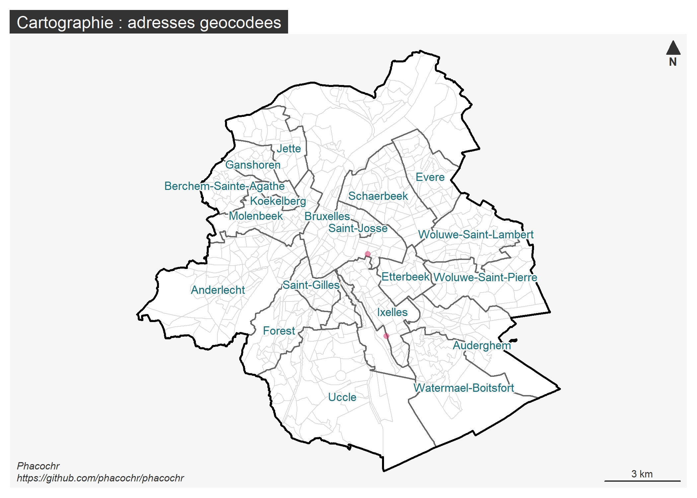

# phacochr 

<!-- badges: start -->

[](https://github.com/GuangchuangYu/badger/actions)
[](https://github.com/phacochr/phacochr/blob/main/LICENSE)
[](https://svgshare.com/i/Zhy.svg)
[](https://svgshare.com/i/ZhY.svg)
[](https://svgshare.com/i/ZjP.svg)

<!-- badges: end -->

PhacochR est un géocodeur pour la Belgique sous forme de package R. A
partir d’une liste d’adresses, il permet de retrouver les coordonnées
X-Y nécessaires à toute analyse spatiale.

Le programme fonctionne à partir des données publiques [BeST
Address](https://opendata.bosa.be/) compilées par BOSA à partir des
données régionales URBIS (Région de Bruxelles-Capitale), CRAB (Région
flamande) et ICAR (Région wallonne). La logique de phacochR est de
réaliser une jointure inexacte entre la liste à géocoder et les données
BeST Address (grâce aux packages R
[fuzzyjoin](https://cran.r-project.org/web/packages/fuzzyjoin/index.html)
et
[stringdist](https://cran.r-project.org/web/packages/stringdist/index.html)).
PhacochR dispose également de plusieurs options : il réalise des
corrections orthographiques préalables (en français et néérlandais) et
trouve le numéro le plus proche - de préférence du même côté de la rue -
si les coordonnées du numéro indiqué sont inconnues. PhacochR est
compatible avec les 3 langues nationales : il géocode des adresses
écrites en français, néérlandais et allemand.

## Installation

Vous pouvez installer le package phacochr depuis
[GitHub](https://github.com/). Il est indispensable lors de la première
utilisation d’installer les données nécessaires au géocodage via la
fonction `phaco_setup_data()`. Ces fichiers sont stockés de manière
permanente dans un répertoire de travail sur l’ordinateur.

``` r
# install.packages("devtools")
library(devtools)
devtools::install_github("phacochr/phacochr")

library(phacochr)
# Pour installer les données
phaco_setup_data()
```

Il est possible pour l’utilisateur de mettre à jour lui-même les données
[BeST Address](https://opendata.bosa.be/) (actualisées de manière
hebdomadaire par BOSA) vers les dernières données disponibles en ligne
avec la fonction `phaco_update()` :

``` r
phaco_update()
```

## Exemple

Voici un exemple basé sur un data.frame contenant deux adresses :

``` r
library(phacochr)
x <- data.frame(nom= c("Observatoire de la Santé et du Social", "ULB"),
                rue= c("rue Belliard","avenue Antoine Depage"),
                num=c("71", "30"),
                code_postal=c("1040","1000"))
x
#>                                     nom                   rue num code_postal
#> 1 Observatoire de la Santé et du Social          rue Belliard  71        1040
#> 2                                   ULB avenue Antoine Depage  30        1000
```

Le géocodage se lance simplement avec la fonction `phaco_geocode()` sur
ce data.frame. Le numéro de la rue et le code postal sont des
informations nécessaires mais elles peuvent être intégrées au champ
adresse - il ne faut alors indiquer que la rue. La performance du
géocodage sera cependant légèrement meilleure si tous les champs sont
séparés.

``` r
result <- phaco_geocode(data_to_geocode = x,
                        colonne_rue= "rue",
                        colonne_num_rue= "num",
                        colonne_code_postal="code_postal")
```

``` r
result$data_geocoded [,c(1,17:19)]
#>   ID_address x_31370 y_31370 cd_sector
#> 1          1  150373  170090 21004B13-
#> 2          2  151105  166831 21004C61-
```

Le package dispose également de fonctions de cartographie des adresses
géocodées. `phaco_map_s()` produit des cartes statiques : il suffit de
passer à la fonction l’objet `data_geocoded_sf` créé par
`phaco_geocode()`. La fonction dessine alors les coordonnées des
adresses sur une carte dont les frontières administratives sont
également affichées. Si les adresses se restreignent à Bruxelles, la
carte se limite automatiquement à la Région bruxelloise.

``` r
phaco_map_s(result$data_geocoded_sf)
```



La fonction `phaco_map_i()` produit quant à elle des cartes interactives
:

``` r
phaco_map_i(result$data_geocoded_sf)
#> tmap mode set to interactive viewing
```

## Auteurs

<center>
<a href="https://www.ccc-ggc.brussels/fr/observatbru/accueil">

</a> <a href="https://cartulb.ulb.be/">

</a>
</center>

## Partenariat

<center>
<a href="https://opendata.bosa.be/">
 </a>
</center>
