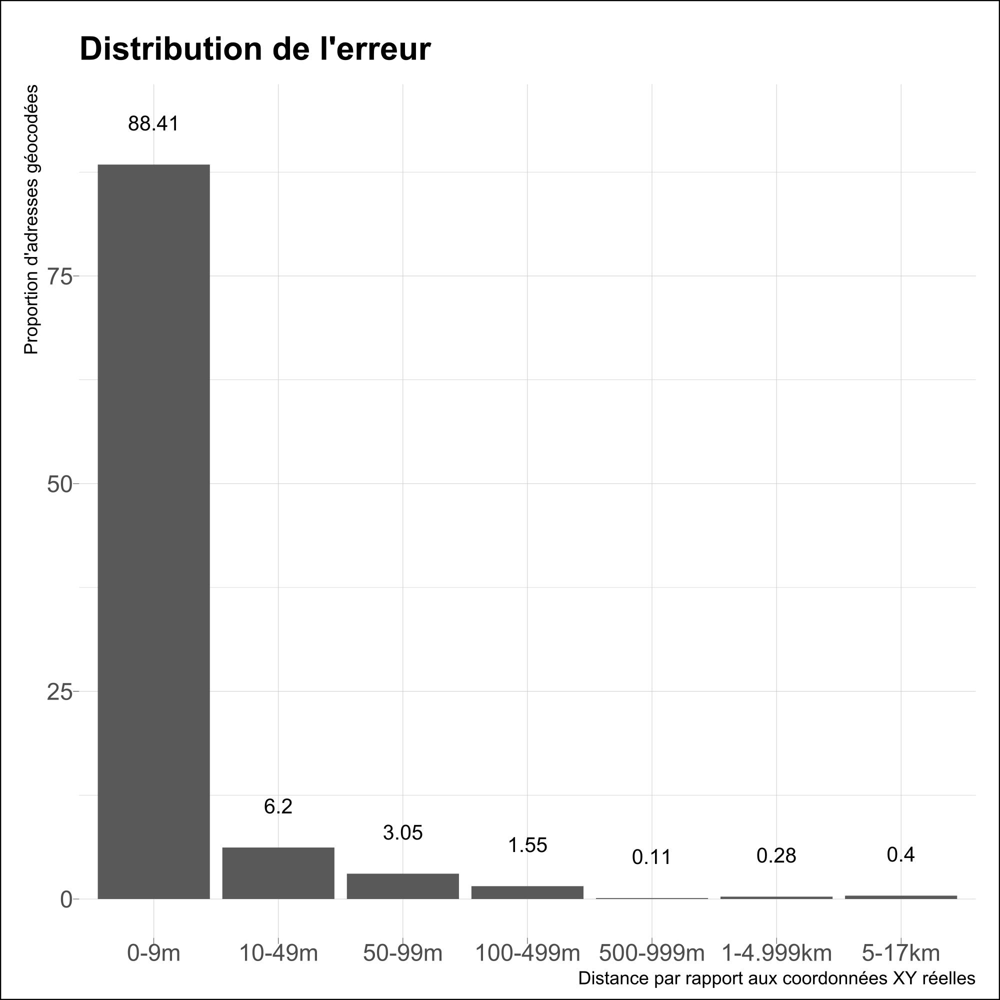

# phacochr 

<!-- badges: start -->

[](https://github.com/phacochr/phacochr/blob/main/LICENSE)
[](https://svgshare.com/i/Zhy.svg)
[](https://svgshare.com/i/ZhY.svg)
[](https://svgshare.com/i/ZjP.svg)

<!-- badges: end -->

`phacochr` est un géocodeur pour la Belgique sous forme de package R.
Son principe est de produire, à partir d’une base de données d’adresses,
une série d’informations nécessaires pour l’analyse spatiale : les
coordonnées X-Y mais également d’autres informations utiles comme le
secteur statistique ou le quartier du monitoring pour Bruxelles. Le
niveau de précision du géocodage est celui du bâtiment.

Le programme fonctionne avec les données publiques [BeST
Address](https://opendata.bosa.be/) compilées par BOSA à partir des
données régionales Urbis (Région de Bruxelles-Capitale), CRAB (Région
flamande) et ICAR (Région wallonne). La logique de `phacochr` est de
réaliser une jointure inexacte entre la liste à géocoder et les données
BeST Address grâce aux fonctions des packages R
[fuzzyjoin](https://cran.r-project.org/web/packages/fuzzyjoin/index.html)
et
[stringdist](https://cran.r-project.org/web/packages/stringdist/index.html).
`phacochr` dispose de plusieurs options : il peut notamment réaliser des
corrections orthographiques (en français et néérlandais) préalables à la
détection des rues ou procéder au géocodage au numéro le plus proche -
de préférence du même côté de la rue - si les coordonnées du numéro
indiqué sont inconnues (par exemple si l’adresse n’existe plus). En cas
de non disponibilité du numéro de la rue, le programme indique les
coordonnées du numéro médian de la rue. `phacochr` est compatible avec
les 3 langues nationales : il géocode des adresses écrites en français,
néérlandais ou allemand.

Le package est très rapide pour géocoder de longues listes (la vitesse
d’exécution se situe entre 0,4 et 0,8 secondes pour 100 adresses sur un
ordinateur de puissance moyenne) et le taux de succès pour le géocodage
est élevé (médiane de 97%). Voir plus bas le point *Performances et
fiabilité de phacochr* pour le détail des performances. `phacochr`
constitue donc une alternative très performante face aux solutions
existantes tout en reposant entièrement sur des données publiques et des
procédures libres.

## Installation

Vous pouvez installer le package `phacochr` depuis
[GitHub](https://github.com/). Il est indispensable lors de la première
utilisation d’installer les données nécessaires à son utilisation via la
fonction `phaco_setup_data()`. Ces fichiers (+/- 265Mo) sont téléchargés
et stockés de manière permanente dans un répertoire de travail sur
l’ordinateur (dépendant du système d’exploitation et renseigné par la
fonction lors de l’installation).

``` r
# Installer devtools si celui-ci n'est pas installé
install.packages("devtools")
library(devtools)

# Installer et charger phacochr
devtools::install_github("phacochr/phacochr")
library(phacochr)

# Installer les données nécessaires à phacochr
phaco_setup_data()
```

Il est également possible pour l’utilisateur de mettre à jour lui-même
les données [BeST Address](https://opendata.bosa.be/) (actualisées de
manière hebdomadaire par BOSA) vers les dernières données disponibles en
ligne avec la fonction `phaco_best_data_update()` :

``` r
phaco_best_data_update()
```

## Exemple de géocodage

Voici un exemple de géocodage d’un data.frame contenant deux adresses :

``` r
x <- data.frame(nom = c("Observatoire de la Santé et du Social", "ULB"),
                rue = c("rue Belliard", "avenue Antoine Depage"),
                num = c("71", "30"),
                code_postal = c("1040", "1000"))
x
#>                                     nom                   rue num code_postal
#> 1 Observatoire de la Santé et du Social          rue Belliard  71        1040
#> 2                                   ULB avenue Antoine Depage  30        1000
```

Le géocodage se lance simplement avec la fonction `phaco_geocode()`
appliquée à ce data.frame. Nous indiquons dans cet exemple 3 paramètres
: les colonnes contenant la rue, le numéro de rue et le code postal,
disponibles séparément dans la base de données. Il s’agit de la
situation idéale, mais le programme est compatible avec d’autres
configurations : celles-ci sont renseignée plus bas au point *Format des
données à géocoder*. Mentionnons déjà que le numéro peut ne pas être
renseigné ; `phacochr` trouve alors les coordonnées du numéro médian de
la rue au code postal indiqué. La fonction dispose de plusieurs options,
voir le dictionnaire des fonctions :
<https://phacochr.github.io/phacochr/reference/index.html>.

``` r
result <- phaco_geocode(data_to_geocode = x,
                        colonne_rue = "rue",
                        colonne_num = "num",
                        colonne_code_postal = "code_postal")
```

``` r
result$data_geocoded [,c("ID_address", "x_31370", "y_31370", "cd_sector")]
#>   ID_address x_31370 y_31370 cd_sector
#> 1          1  150373  170090 21004B13-
#> 2          2  151105  166831 21004C61-
```

Le package dispose également d’une fonction de cartographie des adresses
géocodées (reposant sur le packageR
[mapsf](https://riatelab.github.io/mapsf/) et des shapefiles intégrés
aux données téléchargées). `phaco_map_s()` produit des cartes statiques
à partir des données géocodées : il suffit de passer à la fonction
l’objet `data_geocoded_sf` créé précédemment par `phaco_geocode()`. La
fonction dessine alors les coordonnées des adresses sur une carte dont
les frontières administratives sont également affichées. Si les adresses
se restreignent à Bruxelles, la carte se limite automatiquement à la
Région bruxelloise. Les options de la fonction [sont également
renseignées dans le dictionnaire des
fonctions](https://phacochr.github.io/phacochr/reference/index.html).

``` r
phaco_map_s(result$data_geocoded_sf,
            title_carto = "Institutions des auteurs")
```


## Format des données à géocoder

`phacochr` est compatible avec cinq formats concernant les données à
géocoder. Dans chacun de ces formats, le programme procède à différentes
corrections pour obtenir les informations nécessaires au géocodage. Les
tableau ci-dessous schématisent les différentes configurations
envisageables, indiquent différents exemples à partir d’une même adresse
(le *71 rue Belliard, 1040 Bruxelles*) et mentionnent des notes pour que
l’utilisateur comprenne ce que fait le programme.

1.  **Le numéro de rue, la rue et le code postal sont présents dans des
    colonnes séparées dans les données à géocoder :** il s’agit du
    format idéal qui rencontrera le meilleur résultat. Dans ce cas, il
    faut renseigner les arguments `colonne_num`, `colonne_rue` et
    `colonne_code_postal`.

| ️rue          | num                                       | code_postal                                        |                    | Note                                                                                                                                                                                        |
|:-------------|:------------------------------------------|:---------------------------------------------------|--------------------|---------------------------------------------------------------------------------------------------------------------------------------------------------------------------------------------|
| rue Belliard | 71                                        | 1040                                               | :heavy_check_mark:️ | Situation idéale !                                                                                                                                                                          |
| rue Belliard | 71<span style="color: #FF0000">B</span>   | 1040                                               | :heavy_check_mark:️️ | S’il y a des caractères non numériques après le numéro de rue (lettres, caractères typographiques…), ceux-ci ne sont pas pris en compte.                                                    |
| rue Belliard | 71<span style="color: #FF0000">-73</span> | 1040                                               | :heavy_check_mark:️️ | Si le champ de numéro de rue compte plusieurs numéros, seul le premier est considéré.                                                                                                       |
| rue Belliard | 71                                        | <span style="color: #0000FF">1040 Bruxelles</span> | :heavy_check_mark:️️ | Le nom de la commune (en lettres) peut être indiqué dans le champ code postal ➡ seul le nombre est considéré. L’ordre « code postal - commune » ou « commune - code postal » n’importe pas. |
| rue Belliard | 71                                        | <span style="color: #0000FF">Bruxelles 1040</span> | :heavy_check_mark:️️ |                                                                                                                                                                                             |
| rue Belliard | 71                                        | 1040 <span style="color: #FF0000">Etterbeek</span> | :heavy_check_mark:️️ | Il n’y a pas d’incidence si le nom de la commune est erroné ➡ seul le code postal (nombre) est considéré.                                                                                   |

2.  **Le numéro de rue et la rue sont mélangés dans une colonne, et le
    code postal est seul dans une autre :** ce format demande de
    renseigner les arguments `colonne_num_rue` et `colonne_code_postal`.
    Dans ce format, `phacochr` reconstitue à l’aide des [expressions
    régulières
    (REGEX)](https://r4ds.had.co.nz/strings.html#matching-patterns-with-regular-expressions)
    la rue et le numéro dans des colonnes séparées. Cette procédure
    fonctionne très bien la plupart du temps. Il faut cependant
    respecter une règle importante : le numéro de rue doit être le
    premier numéro indiqué dans la colonne `colonne_num_rue`. Un numéro
    de boite (ou autre numéro) ne peut par exemple pas précéder le
    numéro de rue (cas cependant peu courant).

| code_postal | num_rue                                                      |                    | Note                                                                                                                                                                                                                                             |
|:------------|:-------------------------------------------------------------|--------------------|--------------------------------------------------------------------------------------------------------------------------------------------------------------------------------------------------------------------------------------------------|
| 1040        | <span style="color: #0000FF">71, rue Belliard</span>         | :heavy_check_mark:️️ | Si la rue et le numéro sont intégrés dans le même champ, leur ordre n’a pas d’importance. La présence de signes de ponctuations (virgule, tiret…) ne pose pas de problèmes pour la détection de la rue =\> ils sont nettoyés avec la correction. |
| 1040        | <span style="color: #0000FF">rue Belliard, 71</span>         | :heavy_check_mark:️️ |                                                                                                                                                                                                                                                  |
| 1040        | rue Belliard, 71 <span style="color: #FF0000">bte 5</span>   | :heavy_check_mark:️️ | Le fait que le numéro de boite soit indiqué n’a pas d’incidence =\> il est nettoyé avant la détection de la rue.                                                                                                                                 |
| 1040        | <span style="color: #FF0000">bte 5 -</span> rue Belliard, 71 | :x:                | Il faut cependant respecter une règle importante : le numéro de rue doit être le premier numéro indiqué dans le champ. Le numéro de boite (ou autre numéro) ne peut par exemple pas précéder le numéro de rue (cas peu courant).                 |
| 1040        | rue Belliard, <span style="color: #FF0000">n°</span>71       | :heavy_check_mark:️️ | Le fait que « n° », « no », « n. » soit indiqué avant le numéro n’a pas d’incidence =\> il est nettoyé avant la détection de la rue.                                                                                                             |

3.  **Le numéro de rue, la rue et le code postal sont intégrés dans la
    même colonne :** dans ce format, il faut renseigner l’argument
    `colonne_num_rue_code_postal`. Le géocodeur reconstitue le numéro de
    rue, la rue (comme la situation précédente) mais aussi le code
    postal dans des colonnes séparées. Cette situation fonctionne
    également très bien, à condition d’observer cette règle : le numéro
    doit être le premier nombre et le code postal être en fin de champ
    (situations les plus courantes).

| num_rue_code_postal                                                                           |                    | Note                                                                                                                                                                                                                                              |
|:----------------------------------------------------------------------------------------------|:-------------------|:--------------------------------------------------------------------------------------------------------------------------------------------------------------------------------------------------------------------------------------------------|
| rue Belliard, <span style="color: #0000FF">71 1040</span>                                     | :heavy_check_mark:️ | Dans le cas où la rue, le numéro et le code postal sont intégrés dans un même champ, il faut observer une règle fondamentale : le numéro doit être le premier nombre et le code postal être en fin de champ.                                      |
| <span style="color: #0000FF">71,</span> rue Belliard <span style="color: #0000FF">1040</span> | :heavy_check_mark:️ |                                                                                                                                                                                                                                                   |
| rue Belliard <span style="color: #FF0000">1040 n°71</span>                                    | :x:                |                                                                                                                                                                                                                                                   |
| 71, rue Belliard 1040 <span style="color: #0000FF">Bruxelles</span>                           | :heavy_check_mark:️ | Le nom de la commune (en lettres) peut être accolé au code postal (nombre) si ce dernier est en fin de champ. Si le nom de la commune vient après, il est nettoyé sans condition. S’il vient avant, il doit être écrit avec la bonne orthographe. |
| 71, rue Belliard <span style="color: #0000FF">Bruxelles</span> 1040                           | :heavy_check_mark:️ |                                                                                                                                                                                                                                                   |
| 71, rue Belliard <span style="color: #FF0000">BXL</span> 1040 1040                            | :x:️                |                                                                                                                                                                                                                                                   |

4.  **La rue et le code postal sont présents dans des colonnes séparées
    (sans numéro) :** cette situation ressemble à la première, mais sans
    que le numéro soit disponible. `phacochr` géocode alors non pas à un
    niveau de précision du bâtiment, mais choisi comme coordonnées de
    résultat le bâtiment disposant du numéro médian de la rue au sein du
    même code postal (certaines rues traversant différents codes
    postaux). Ce format demande de renseigner les arguments
    `colonne_rue` et `colonne_code_postal`.

| ️rue          | code_postal |                    | Note |
|:-------------|:------------|--------------------|------|
| rue Belliard | 1040        | :heavy_check_mark:️ |      |

5.  **La rue et le code postal sont intégrés dans la même colonne (sans
    numéro) :** le programme reconstitue la rue et le code postal dans
    des colonnes séparées (comme la situation 3). Dans ce cas, le code
    postal doit être en fin de champ. Lorsque ce n’est pas le cas, le
    programme ne fonctionne pas (situation peu courante). Ce format
    demande de renseigner l’argument `colonne_rue_code_postal`.

| rue_code_postal                                       |                    | Note                                                                                                                                                                |
|:------------------------------------------------------|:-------------------|:--------------------------------------------------------------------------------------------------------------------------------------------------------------------|
| rue Belliard 1040                                     | :heavy_check_mark:️ | Lorsqu’un champ contient la rue et le code postal, ce dernier doit être en fin de champ. Lorsque ce n’est pas le cas, le programme ne fonctionne pas (peu courant). |
| <span style="color: #FF0000">1040</span> rue Belliard | :x:                |                                                                                                                                                                     |

## Logique

Nous expliquons ici avec plus de détail la logique du traitement réalisé
par `phacochr`. Celui-ci repose sur les données BeST Address, que nous
avons reformatées pour optimiser le traitement. Nous avons également
utilisé des données produites par Statbel et Urbis dans ce reformatage.
Nous ne rentrons pas dans l’explication de ces modifications ici, et
renvoyons au [code de la fonction `phaco_best_data_update()` disponible
sur
Github](https://github.com/phacochr/phacochr/blob/main/R/phaco_best_data_update.R).

Nous nous concentrons ici sur les opérations réalisées par la fonction
`phaco_geocode()`, fonction de géocodage à proprement parler. Si l’on
schématise, ces opérations se classent en trois grandes familles :

1)  **Formatage des données :** le programme détecte d’abord la
    configuration des données à géocoder, et créé les colonnes nettoyées
    de numéro de rue (si disponible, ce qui est souvent le cas), de rue
    et de code postal. Des corrections sont faites pour chacun de ces
    champs, afin de maximiser les chances de trouver l’adresse dans la
    suite des opérations.
2)  **Détection des rues :** `phacochr` procède alors à une *jointure
    inexacte* entre chacune des rues (nettoyées au point précédent) et
    l’ensemble des rue de BeST Address *au sein du code postal indiqué*.
    Un matching inexact est nécessaire pour pouvoir apparier la rue des
    données BeST (disons *Rue Belliard* au code postal 1040) avec la
    même rue telle qu’elle est écrite concrètement dans la base de
    données à géocoder, potentiellement avec des coquilles ou fautes
    d’orthographe (par exemple *Rue Beliar* avec un seul *l* et sans
    *d*, également au code postal 1040). Le matching inexact est
    parallélisé sur les n-1 cores du CPU afin d’augmenter la vitesse du
    traitement (de nombreuses combinaisons devant être calculées). Le
    paramètre `error_max` permet d’indiquer l’erreur acceptable par
    l’utilisateur. Celle-ci est réglée par défaut à `4`, ce qui permet
    de trouver des rues mal orthographiées, sans les confondre avec
    d’autres, avec un très bon taux de succès. Augmenter ce paramètre
    accroît le pourcentage de rues trouvées, mais aussi d’erreurs
    réalisées. Dans le cas où la langue dans laquelle les adresses sont
    inscrites est connue, elle peut être renseignée via l’argument
    `lang_encoded`, ce qui augmente la vitesse et la fiabilité du
    processus en limitant le matching à la langue définie. Si la rue
    n’est pas trouvée, le programme étend sa recherche à la commune
    entière et à toutes les communes limitrophes. Cette procédure
    optionnelle peut être désactivée avec le paramètre
    `elargissement_com_adj = FALSE`.
3)  **Jointure avec les coordonnées géographiques :** une fois les rues
    trouvées, il est désormais possible de réaliser une *jointure
    exacte* avec les données BeST géolocalisées au niveau du numéro,
    celles-ci comprenant les coordonnées X-Y de l’ensemble des adresses
    en Belgique. Pour ce faire, seuls les arrondissements dans lesquels
    sont présents les codes postaux des données à géocoder sont chargés
    en RAM, pour augmenter la vitesse du traitement et soulager
    l’ordinateur. Les coordonnées des adresses qui ne sont pas trouvées
    sont approximées en trouvant les coordonnées connues de l’adresse la
    plus proche du même côté de la rue. L’amplitude maximale de cette
    approximation est réglable avec le paramètre `approx_num_max` (réglé
    par défaut à `50` ; indiquer `0` pour désactiver l’approximation).
    Dans le cas où les coordonnées ne sont pas trouvées, ce sont celles
    du numéro médian de la rue (proxy du milieu de la rue) qui sont
    indiquées (option activée par défaut et désactivable avec l’argument
    `mid_street = FALSE`). Si les données ne possèdent pas de numéro,
    c’est cette information qui est indiquée comme résultat du
    géocodage.

La procédure de géocodage est alors terminée. Les coordonnées X-Y
produites se trouvent dans les colonnes `x_31370` et `y_31370` au format
Lambert 72. Outre ces coordonnées, sont jointes à chaque adresse trouvée
différentes informations utiles. On y trouve notamment (la liste
complète est disponible au point *Colonnes créées par phacochr* en fin
de page) :

-   Les secteurs statistiques (colonne `cd_sector` et leurs noms en NL
    et FR `tx_sector_descr_nl` et `tx_sector_descr_fr`) ;
-   Les quartiers monitoring pour Bruxelles (colonne `MDRC` et leurs
    noms en NL et FR `NAME_DUT` et `NAME_FRE` ) ;
-   Les codes INS des communes, arrondissements, provinces et regions
    (ainsi que leurs noms en FR et NL) dans des colonnes qui suivent les
    appelations classiques de Statbel ;
-   Toute une série d’indicateurs sur la qualité de la localisation
    (voir point suivant *Performances et fiabilité de phacochr*).

Le résultat du géocodage est une liste (au sens de R). Il comprend trois
objets :

-   `data_geocoded` : la base de données originale à laquelle sont
    ajoutées les informations précitées ;
-   `data_geocoded_sf` : [un objet
    `sf`](https://r-spatial.github.io/sf/) produit à partir des adresses
    pour lesquelles des coordonnées ont effectivement été trouvées (le
    nombre de lignes reprises dans l’objet dépend donc du taux de
    géocodage). Cet objet est exportable en .gpkg (ou autre format
    vectoriel) à l’aide de la fonction
    [st_write](https://r-spatial.github.io/sf/reference/st_write.html)
    ou peut directement être cartographié avec la fonction `phaco_map_s`
    ;
-   `summary` : un tableau avec quelques statistiques synthétiques
    indiquant la performance du géocodage.

Le tableau ci-dessous schématise l’ensemble des opérations réalisées et
expliquées précédemment :

<figure>

<figcaption aria-hidden="true">Tableau schématique du traitement opéré
par phacochr</figcaption>
</figure>

## Performances et fiabilité

Nous présentons ici quelques mesures des performances de `phacochr`.
Nous avons réalisé des tests sur 18 bases de données réelles fournies
par des collègues (merci à elles et eux).

La vitesse d’exécution par adresse suit une fonction inverse (1/x).
`phacochr` est bien meilleur avec un nombre conséquent d’adresses. Ceci
vient entre autre du fait qu’il doit charger des données volumineuses
avant de réaliser les traitements : le “coût” marginal en temps de ce
chargement est d’autant plus faible que les données sont nombreuses à
géocoder. A partir de 2000 adresses, la vitesse d’exécution se situe
entre 0,4 et 0,8 secondes / 100 adresses. A titre d’exemple, 2 adresses
sont trouvées en 16s, géocoder 300 adresses prend environ 20s, 1000
adresses 25s, 20 000 adresses 140s.

<figure>

<figcaption aria-hidden="true">Graphique du temps de calcul nécessaire
pour géocoder avec phacochr selon le nombre d’adresses à
géocoder</figcaption>
</figure>

`phacochr` possède une bonne capacité à trouver les adresses. Sur le
même set de 18 bases de données, la médiane du pourcentage d’adresses
trouvées est de 97%. Pour 7 bases de données sur les 18, `phacochr`
trouve les coordonnées à plus de 98%, pour 6 bases de données entre 96%
et 98% et pour 5 bases de données entre 90% et 96%.

<figure>

<figcaption aria-hidden="true">Graphique du pourcentage d’adresses
géocodées</figcaption>
</figure>

Ces résultats sur la performance sont à nuancer par le fait qu’il y a
probablement des “faux positifs” (normalement peu nombreux avec les
réglages par défaut). Pour avoir une idée de la qualité des résultats,
il est conseillé de vérifier plusieurs éléments (la synthèse des
indicateurs de qualité du géocodage est disponible au point **Colonnes
créées par phacochr** en fin de page) :

-   Vérifier globalement que les corrections orthographiques ont bien
    fonctionné (la colonne `rue_recoded` comprend la rue nettoyée et
    corrigée, et `recode` indique les types de corrections réalisées) ;
-   Comparer les rues détectées par `phacochr` (la colonne
    `street_FINAL_detected`) avec les rues d’origine pour les erreurs
    les plus élevées dans la jointure inexacte (la colonne `dist_fuzzy`
    indique le nombre d’erreurs nécessaires pour faire la jointure avec
    les données BeST. `0` signifie que le matching est exact) ;
-   Procéder à la même comparaison pour les rues dont la détection a
    nécessité un élargissement aux communes adjacentes (colonne
    `type_geocoding == elargissement_adj`). Une rue au même nom aurait
    pu être trouvée dans une commune voisine ;
-   Vérifier la proportion des adresses qui ont nécessité une
    localisation géographique à un autre numéro si celui renseigné n’a
    pas été trouvé, ainsi que l’ampleur de cette approximation (colonne
    `approx_num`) ;
-   Vérifier la proportion des adresses qui ont demandé une localisation
    au numéro médian de la rue au code postal indiqué si aucune autre
    localisation plus précise n’a plus être réalisée (colonne
    `type_geocoding == mid_street`).

Malgré cette mise en garde, `phacochr` reste fiable. Nous avons mesuré
la *distance* (euclidienne, en mètres) entre la géolocalisation opérée
par `phacochr` avec ses réglages par défaut et les coordonnées spatiales
déjà présentes dans deux bases de données : celle des écoles
néérlandophones et celle des pharmacies, les deux pour toute la
Belgique. Cette distance peut être interprétée comme l’*erreur dans la
géolocalisation* (bien qu’il est possible que les coordonnées déjà
présentes dans ces deux bases de données ne soient pas précises : nous
n’avons pas investigué la manière dont elles ont été produites). Le
tableau suivant montre la répartition en pourcentages de cette erreur
par classe de distance. On voit ainsi que 97,6% des adresses géocodées
sont localisées à moins de 100m de leurs coordonnées “réelles”, montrant
un degré de fiabilité tout à fait satisfaisant.

<figure>

<figcaption aria-hidden="true">Graphique de la répartition de l’erreur
de géolocalisation</figcaption>
</figure>

## Colonnes créées

Le principe de `phacochr` est d’adjoindre une série d’informations à la
liste d’adresses originale : il s’agit bien entendu d’informations
spatiales (coordonnées X-Y et des informations administratives sur les
entités spatiales) mais également d’indices sur la qualité du géocodage.
En voici une liste exhaustive et commentée:

| **Colonne créée**            | **Signification**                                                                                                                                                                                                                                                                                                                                       |
|------------------------------|---------------------------------------------------------------------------------------------------------------------------------------------------------------------------------------------------------------------------------------------------------------------------------------------------------------------------------------------------------|
| **ID_address**               | Un identifiant unique par ligne du tableau original créé pour le bon fonctionnement de `phacochr`. Le nombre maximal de cet identifiant est égal au nombre de lignes du tableau.                                                                                                                                                                        |
| **rue_recoded**              | La rue extraite, nettoyée et corrigée à partir du champ original contenant la rue. C’est par le biais de cette colonne qu’est réalisé le matching inexact pour la rue.                                                                                                                                                                                  |
| **recode**                   | Indique les diffétents nettoyages / corrections réalisés pour obtenir `rue_recoded`.                                                                                                                                                                                                                                                                    |
| **street_FINAL_detected**    | La rue détectée par `phacochr` issue des données BeST. *`NA` si aucune rue n’a été détectée*.                                                                                                                                                                                                                                                           |
| **num_rue_clean**            | Le numéro de rue nettoyé (un nombre unique est extrait, sans lettres ou caractères typographiques).                                                                                                                                                                                                                                                     |
| **code_postal_to_geocode**   | Le code postal nettoyé (sans nom de commune s’il était présent dans le champ original). Si la rue est trouvée dans une commune adjacente, le code postal où se trouve cette rue remplace le code postal original dans cette colonne.                                                                                                                    |
| **street_id_phaco**          | L’identifiant numérique des rues BeST propre à `phacochr`. Cet identifiant est créé lors du géocodage. Ce champ n’est pas utile pour l’utilisateur.                                                                                                                                                                                                     |
| **langue_FINAL_detected**    | La langue détectée d’écriture de la rue (`FR`, `NL` ou `DE`). *`NA` si aucune rue n’a été détectée*.                                                                                                                                                                                                                                                    |
| **nom_propre_abv**           | Une valeur `1` indique que `phacochr` a détecté un nom propre abrégé dans le champ de rue original (*`NA` dans le cas contraire*). Cette information est produite durant le processus de détection des rues dans le but de maximiser la détection des rues dont les noms propres sont orthographiés avec des abréviations.                              |
| **mid_num**                  | Le numéro médian de la rue au code postal considéré.                                                                                                                                                                                                                                                                                                    |
| **mid_x\_31370**             | La coordonnée X (format: Lambert 72) du numéro médian de la rue au code postal considéré.                                                                                                                                                                                                                                                               |
| **mid_y\_31370**             | La coordonnée Y (format: Lambert 72) du numéro médian de la rue au code postal considéré.                                                                                                                                                                                                                                                               |
| **mid_cd_sector**            | Le secteur statistique du numéro médian de la rue au code postal considéré.                                                                                                                                                                                                                                                                             |
| **dist_fuzzy**               | Indique le nombre d’erreurs qui ont été nécessaires pour faire la jointure avec les données de rue BeST. La valeur maximale est égal à `error_max` (`4` par défaut); `0` signifie que le matching est exact. *`NA` si aucune rue n’a été détectée*.                                                                                                     |
| **type_geocoding**           | Indique la nature du géocodage. Les rues dont la détection a nécessité un élargissement aux communes adjacentes sont indiquées par la valeur `elargissement_adj`. Les adresses qui ont demandé une localisation au numéro médian de la rue au code postal indiqué sont signalées par la valeur `mid_street`. Les autres cas présentent une valeur vide. |
| **house_number_sans_lettre** | Le numéro qui a été géolocalisé dans les données BeST.                                                                                                                                                                                                                                                                                                  |
| **x_31370**                  | Les coordonnée X (format: Lambert 72) du numéro indiqué. Si la localisation n’a pu se faire qu’au numéro médian de la rue (`type_geocoding == mid_street`), la valeur est la même que `mid_x_31370`. *`NA` si aucune coordonnée n’a été trouvée*.                                                                                                       |
| **y_31370**                  | Les coordonnée Y (format: Lambert 72) du numéro indiqué. Si la localisation n’a pu se faire qu’au numéro médian de la rue (`type_geocoding == mid_street`), la valeur est la même que `mid_y_31370`. *`NA` si aucune coordonnée n’a été trouvée*.                                                                                                       |
| **cd_sector**                | Le secteur statistique. Si la localisation n’a pu se faire qu’au numéro médian de la rue (`type_geocoding == mid_street`), la valeur est la même que `mid_cd_sector`. *`NA` si aucune coordonnée n’a été trouvée*.                                                                                                                                      |
| **approx_num**               | Indique si la localisation n’a pas pu se faire au numéro indiqué. La valeur indique la distance entre le numéro “réel” indiqué et celui effectivement localisé. `0` si la localisation est exacte au numéro. *`NA` si aucune coordonnée n’a été trouvée au numéro exact ou approximé* (elles ont cependant pu l’être pour le milieu de la rue).         |
| **tx_sector_descr_nl**       | Le nom du secteur statistique en NL (Statbel).                                                                                                                                                                                                                                                                                                          |
| **tx_sector_descr_fr**       | Le nom du secteur statistique en FR (Statbel).                                                                                                                                                                                                                                                                                                          |
| **cd_sub_munty**             | Code Refnis des subdivisions des communes (Statbel).                                                                                                                                                                                                                                                                                                    |
| **tx_sub_munty_nl**          | Nom des subdivisions des communes en NL (Statbel).                                                                                                                                                                                                                                                                                                      |
| **tx_sub_munty_fr**          | Nom des subdivisions des communes en FR (Statbel).                                                                                                                                                                                                                                                                                                      |
| **cd_munty_refnis**          | Code Refnis des communes (Statbel).                                                                                                                                                                                                                                                                                                                     |
| **tx_munty_descr_nl**        | Nom des subdivisions des communes en NL (Statbel).                                                                                                                                                                                                                                                                                                      |
| **tx_munty_descr_fr**        | Nom des subdivisions des communes en FR (Statbel).                                                                                                                                                                                                                                                                                                      |
| **cd_dstr_refnis**           | Code Refnis de l’arrondissement (Statbel).                                                                                                                                                                                                                                                                                                              |
| **tx_adm_dstr_descr_nl**     | Nom de l’arrondissement en NL (Statbel).                                                                                                                                                                                                                                                                                                                |
| **tx_adm_dstr_descr_fr**     | Nom de l’arrondissement en FR (Statbel).                                                                                                                                                                                                                                                                                                                |
| **cd_prov_refnis**           | Code Refnis de la province (Statbel).                                                                                                                                                                                                                                                                                                                   |
| **tx_prov_descr_nl**         | Nom de la province en NL (Statbel).                                                                                                                                                                                                                                                                                                                     |
| **tx_prov_descr_fr**         | Nom de la province en FR (Statbel).                                                                                                                                                                                                                                                                                                                     |
| **cd_rgn_refnis**            | Code Refnis de la région (Statbel).                                                                                                                                                                                                                                                                                                                     |
| **tx_rgn_descr_nl**          | Nom de la région en NL (Statbel).                                                                                                                                                                                                                                                                                                                       |
| **tx_rgn_descr_fr**          | Nom de la région en FR (Statbel).                                                                                                                                                                                                                                                                                                                       |
| **MDRC**                     | Code du quartier monitoring pour Bruxelles (Urbis).                                                                                                                                                                                                                                                                                                     |
| **NAME_FRE**                 | Nom du quartier monitoring pour Bruxelles en FR (Urbis).                                                                                                                                                                                                                                                                                                |
| **NAME_DUT**                 | Nom du quartier monitoring pour Bruxelles en NL (Urbis).                                                                                                                                                                                                                                                                                                |

## Autres géocodeurs libres

-   [Nominatim](https://nominatim.org/): le géocodeur de OpenStreetMap.
-   [BHiGIS – Brussels Historical Geographical Information
    System](https://ebxl.be/les-outils/bhigis/): un géocodeur développé
    par l’IGEAT permettant de géocoder des données anciennes à
    Bruxelles.

## Contact

Si vous rencontrez un bug à l’utilisation, n’hésitez pas à nous en faire
part : nous désirons améliorer le programme et sommes intéressés d’avoir
le maximum de retours. Les deux auteurs de ce package sont chercheurs en
sociologie et en géographie ; nous ne sommes pas programmeurs de
profession, et sommes donc également preneurs de toute proposition
d’amélioration ! Rendez-vous dans la section ‘issues’ sur notre
[Github](https://github.com/phacochr/phacochr/issues).

## Auteurs

<center>
<a href="https://www.ccc-ggc.brussels/fr/observatbru/accueil">

</a> <a href="https://cartulb.ulb.be/">

</a>
</center>

## Partenariat

<center>
<a href="https://opendata.bosa.be/">
 </a>
</center>
