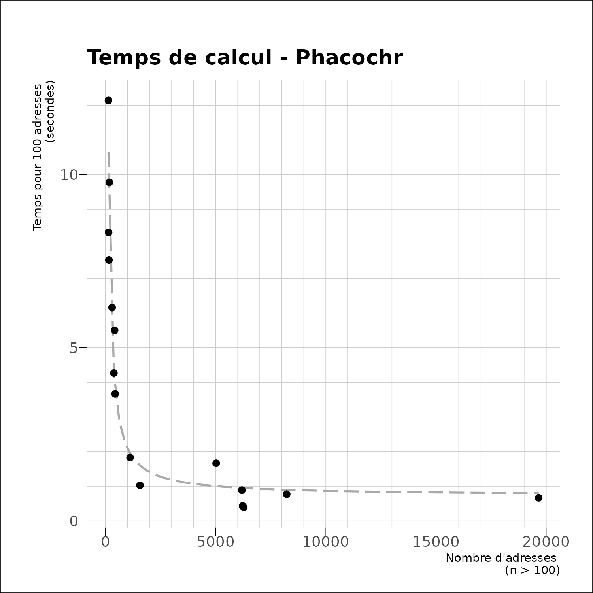
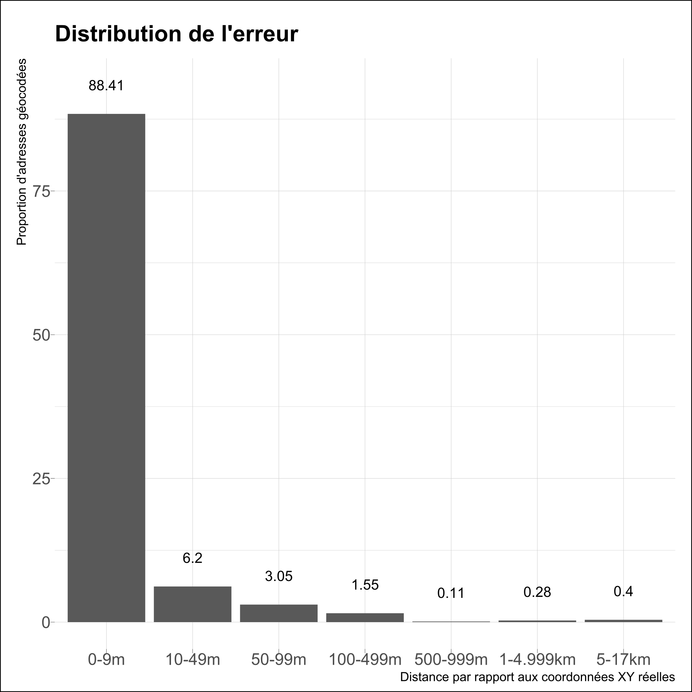

```{r, include = FALSE}
knitr::opts_chunk$set(
  collapse = TRUE,
  comment = "#>"
)
```

## Performances

Nous présentons ici quelques mesures des performances de `phacochr`. Nous avons réalisé des tests sur 18 bases de données réelles fournies par des collègues (merci à elles et eux).

La vitesse d'exécution par adresse suit une fonction inverse (1/x). `phacochr` est bien meilleur avec un nombre conséquent d'adresses. Ceci vient entre autre du fait qu'il doit charger des données volumineuses avant de réaliser les traitements : le "coût" marginal en temps de ce chargement est d'autant plus faible que les données sont nombreuses à géocoder. A partir de 2000 adresses, la vitesse d'exécution se situe entre 0,4 et 0,8 secondes / 100 adresses sur un PC de puissance moyenne. A titre d'exemple, sur ce même PC, 2 adresses sont trouvées en 16s, géocoder 300 adresses prend environ 20s, 1000 adresses  25s, 20 000 adresses 140s.

```{r out.width = '70%', echo = FALSE}
# Graphique du temps de calcul nécessaire pour géocoder avec phacochr selon le nombre d'adresses à géocoder

```

`phacochr` possède une bonne capacité à trouver les adresses. Sur le même set de 18 bases de données, la médiane du pourcentage d'adresses trouvées est de 97%. Pour 7 bases de données sur les 18, `phacochr` trouve les coordonnées à plus de 98%, pour 6 bases de données entre 96% et 98% et pour 5 bases de données entre 90% et 96%.

```{r out.width = '70%', echo = FALSE}
# Graphique du pourcentage d'adresses géocodées
knitr::include_graphics("img/graph_match_rate.png")
```


## Fiabilité

Pour mesurer la fiabilité de `phacochr`, Nous avons mesuré la *distance* (euclidienne, en mètres) entre la géolocalisation opérée par `phacochr` avec ses réglages par défaut et les coordonnées spatiales déjà présentes dans deux bases de données : celle des écoles néérlandophones et celle des pharmacies, les deux pour toute la Belgique. Cette distance peut être interprétée comme l'*erreur dans la géolocalisation* (bien qu'il est possible que les coordonnées déjà présentes dans ces deux bases de données ne soient pas précises : nous n'avons pas investigué la manière dont elles ont été produites). Le tableau suivant montre la répartition en pourcentages de cette erreur par classe de distance. On voit ainsi que 97,6% des adresses géocodées sont localisées à moins de 100m de leurs coordonnées "réelles", montrant un degré de fiabilité tout à fait satisfaisant.

```{r out.width = '70%', echo = FALSE}
# Graphique de la répartition de l'erreur de géolocalisation

```
